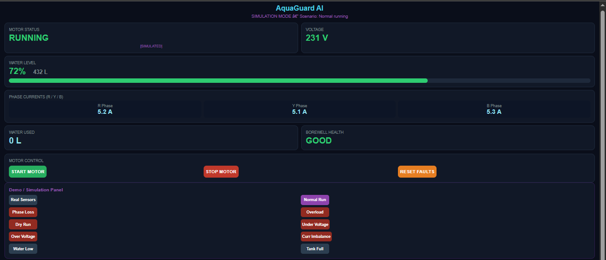
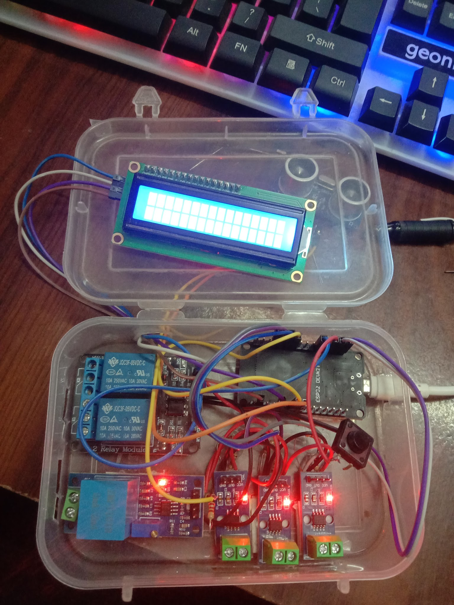
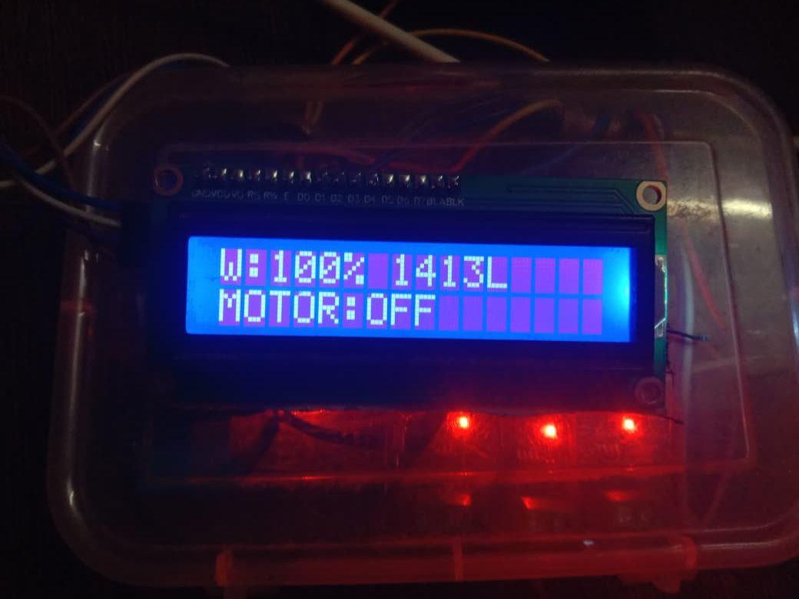
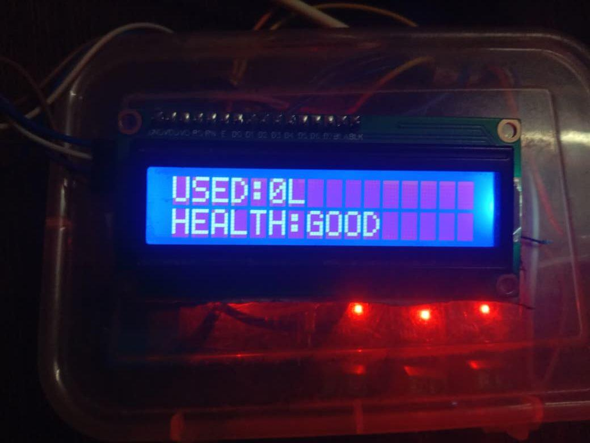
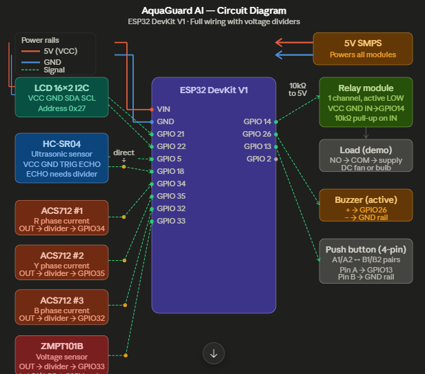

# AquaGuard AI — Smart Borewell Motor Protection System

> ESP32-based real-time protection and monitoring system for 415V three-phase agricultural induction motors used in borewell pumps and irrigation setups.

---

## 📸 Screenshots

### Web Dashboard


### Hardware Prototype


### LCD Display



### circuit diagram


---

## 🔍 What It Does

Agricultural borewell motors burn out constantly due to phase loss, voltage fluctuations, dry running, and overloads — with no warning. AquaGuard AI monitors all of these in real time and automatically trips the motor before damage occurs, then restarts it safely once conditions recover.

**All 7 fault scenarios tested and passed:**

| Fault | Detection Time |
|---|---|
| Phase Loss | < 1.2 s |
| Overload (150% rated current) | < 2.0 s |
| Dry Run | < 3.5 s (auto-restart blocked till water recovered) |
| Under-Voltage (< 180V) | < 0.8 s |
| Over-Voltage (> 260V) | < 0.8 s |
| Normal Startup inrush (~300% for ~800ms) | No nuisance trip ✅ |
| Auto-Restart after fault | After 30s stable conditions |

---

## ⚙️ Features

- **Phase-wise RMS fault discrimination** — phase loss, overload, over/under-voltage, dry-run, current imbalance
- **Trip-delay logic** — prevents nuisance trips on motor startup inrush
- **Auto-restart** after 30 seconds of stable conditions
- **Safety lockout** after 3 consecutive faults — requires manual reset
- **HC-SR04 water level monitoring** — blocks motor start if water < 10%
- **16×2 I2C LCD** with 3 rotating screens (water level, voltage/current, fault status)
- **WiFi cloud dashboard** via Blynk — monitor and control remotely
- **Offline hotspot fallback** — access dashboard at `192.168.4.1` when no WiFi
- **Water usage tracking** and borewell health display

---

## 🔧 Hardware

| Component | Purpose |
|---|---|
| ESP32 DevKit V1 | Main controller (240 MHz dual-core, built-in WiFi) |
| 3× ACS712-20A | Three-phase current sensing (R, Y, B) — GPIO 34, 35, 32 |
| ZMPT101B | AC voltage sensing — GPIO 33 |
| HC-SR04 | Ultrasonic water level — TRIG: GPIO 5, ECHO: GPIO 18 |
| Relay + Contactor | Motor switching (415V isolation) — GPIO 27 |
| 16×2 I2C LCD | Local display (I2C address 0x27) — SDA: GPIO 21, SCL: GPIO 22 |
| Buzzer | Audible fault alert — GPIO 26 |
| Push Button | Manual screen switch — GPIO 13 |

---

## 📁 File Structure

```
AquaGuard-AI/
├── AquaGuard_AI.ino     # Main firmware — setup() and loop()
├── config.h             # All pin mappings, thresholds, and calibration constants
├── sensors.h            # ACS712, ZMPT101B, HC-SR04 sensor read functions
├── protection.h         # Fault discrimination logic and trip/restart state machine
├── display.h            # LCD screen rotation and fault display
├── connectivity.h       # WiFi, hotspot fallback, local web dashboard
├── blynk_cloud.h        # Blynk cloud integration and virtual pin map
└── images/              # Dashboard and hardware photos
```

---

## 🚀 Getting Started

### Requirements
- Arduino IDE 2.x
- ESP32 board package installed (`https://raw.githubusercontent.com/espressif/arduino-esp32/gh-pages/package_esp32_index.json`)

### Libraries needed (install via Arduino Library Manager)
- `LiquidCrystal_I2C`
- `Blynk` (for cloud monitoring)

### Setup
1. Open `AquaGuard_AI.ino` in Arduino IDE
2. Edit `config.h` — set your WiFi credentials and Blynk auth token
3. Calibrate `ZMPT_CALIBRATION` and `ACS712_SENSITIVITY` values against known readings
4. Set `SENSOR_MOUNT_HEIGHT_CM` and `TANK_DIAMETER_CM` to match your tank geometry
5. Flash to ESP32 DevKit V1 at 115200 baud

### Blynk Setup
1. Create a free account at [blynk.cloud](https://blynk.cloud)
2. Create a new template named `AquaGuard AI`
3. Copy Template ID, Template Name, and Auth Token into `config.h`
4. Virtual pins V0–V11 map to all sensor readings and controls (see `config.h`)

---

## 📊 Fault Thresholds (configurable in `config.h`)

| Parameter | Default Value |
|---|---|
| Rated Voltage | 230V |
| Under-Voltage Trip | < 180V |
| Over-Voltage Trip | > 260V |
| Rated Current | 8A |
| Overload Trip | > 10A |
| Dry-Run Trip | < 1.0A during pump operation |
| Phase Loss Trip | < 0.3A on any phase |
| Current Imbalance Allowed | ±20% between phases |
| Min Water to Allow Start | 10% |
| Auto-Restart Delay | 30 seconds |
| Max Restart Attempts | 3 (then safety lockout) |

---

## 📄 Project Report

Full project presentation with system design, fault algorithm flowchart, results, and discussion: [`AquaGuard_AI_Updated.pptx`](AquaGuard_AI_Updated.pptx)

---

## 👨‍💻 Team
- N. Anirudh 
- V. Ranjith Kumar 
- A. Karthik 
- R. Mahesh Babu 


